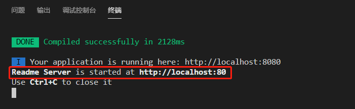
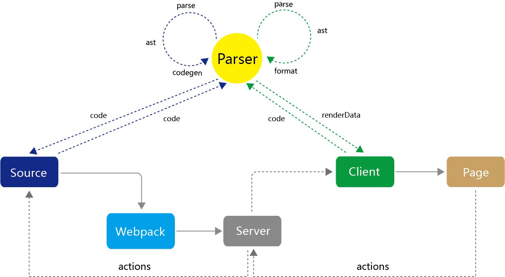
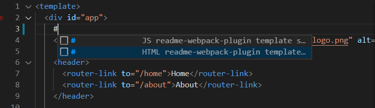

<div align="center">
  <a href="https://github.com/webpack/webpack">
    
  </a>
  <h1>Readme-Webpack-Plugin</h1>
  <p>我们可以在任何源码中写 markdown，并且提供了一个可交互的markdown管理客户端。</p>
</div>

<Br/><Br/>

<h2 align="center">视频教程</h2>
[视频地址](https://www.bilibili.com/video/BV1fM4y1V7uv): https://www.bilibili.com/video/BV1fM4y1V7uv


<Br/><Br/>

<h2 align="center">安装方法</h2>

```bash

npm install --save-dev readme-original-loader
npm install --save-dev readme-webpack-plugin

```

```js
const ReadmeWebpackPlugin = require('readme-webpack-plugin');

module.exports = {
  module: {
    rules: [
      {
        test: /\.(js|vue|css|scss|sass|ts|tsx)$/,
        loader: 'readme-original-loader',
        enforce: 'pre',
        include: [resolve('src')],
        options: {}
      }
    ]
  },
  plugins: [
    new ReadmeWebpackPlugin({
        base:'BASE-README',     // 基础 markdown 文件名
        mode:'server',          // 模式
        server:{                
          host:'localhost',     // 设置host
          port: '1234',           // 设置port
        },
        output:{
          filename:'README'     // 静态 markdown 文件名
        },
        open:false              // 是否自动打开浏览器
    })
  ]
}
```

启动项目后，终端会提示一个地址：http://localhost:1234

  


<Br/><Br/>

<h2 align="center">使用方式</h2>

1. 两种创建记录的语法

    书写一条记录语法会在客户端生成一个记录。

    - 类HTML注释语法

    ```
        <!--## 
        #{1 - type - title}# 
        markdown
        ###-->
    ```

    - 类JavaScript注释语法

    ```
        <!--## 
        #{1 - type - title}# 
        markdown
        ###-->
    ```

2. 关联记录
   
   通过标题最后一个参数去关联父记录的id

   


3. 删除记录
   
   


4. 更新源码
   
   


5. 与已有 markdown 进行整合
   
   在项目根目录下新建一个BASE-README.md文件，此文件中的markdown自动被收集到客户端中。
   
   


<Br/><Br/>


<h2 align="center">原理图</h2>




<Br/><Br/>

<h2 align="center">VScode代码片段</h2>

   配置代码提示后，输入‘#’号提示记录语法模板




 ```
 "JS readme-webpack-plugin template syntax1": {
      "scope": "",
      "prefix": "#",
      "body": [
        "/*#### \n #{1 - todo - title}# \n markdown \n ####*/"
      ],
      "description": ""
},

"HTML readme-webpack-plugin template syntax2": {
      "scope": "",
      "prefix": "#",
      "body": [
        "<!--## \n #{1 - todo - title}# \n markdown \n ###-->"
      ],
      "description": ""
}

 ```


 